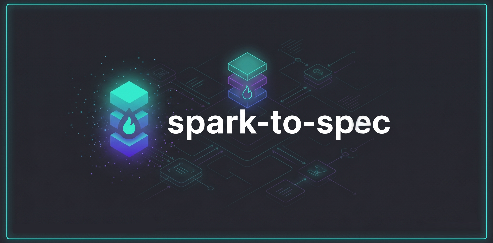

# spark-to-spec

<picture>
  <source srcset="docs/assets/logo-animation-intro.gif" type="image/gif">
  
</picture>

A conversational validation framework for technical founders. This skill takes a raw product idea (the "spark") and challenges it through a 5-phase rigorous validation process, producing either a kill rationale or an engineering draft PRD (Product Requirement Document) viable for spec-driven frameworks.

## Why spark-to-spec?

Spec-driven development (SDD) frameworks (like `speckit`) are powerful for building what you ask for, but they don't challenge *what* you are building. `spark-to-spec` fills this gap by:
- **Challenging the Idea**: Ensuring the solution is viable before a single line of spec is written.
- **Validating the Pain**: Confirming that the problem actually exists and is worth solving.
- **Preparing the Input**: It doesn't replace SDD; it prepares the clear, validated input they require to be effective.

## Features

- **5-Phase Validation**: Deconstruct, Extract, Viability Gate, Map, Prototype Brief, and MVP Spec.
- **Socratic Grilling**: Challenges assumptions and avoids optimism bias.
- **Continuous Saving**: Progress is saved to a `.spark.md` file after every turn.
- **Auto-Update**: Automatically checks for newer versions on npm.
- **Framework Explanations**: Explains external methodologies (The Mom Test, etc.) in plain language.
- **Terse & Efficient**: Designed for speed with concise, fragment-based communication.

## Installation

Install globally via npm:

```bash
npm install -g spark-to-spec
```

The post-install script will automatically detect and install the skill for both **Gemini CLI** and **Claude Code**.

## Usage

Once installed, invoke the skill within your AI agent:

### In Gemini CLI
```bash
/spark-to-spec "My cool app idea"
```

### In Claude Code
```bash
/spark-to-spec "My cool app idea"
```

If a `.spark.md` file already exists in your current directory, the skill will automatically resume from the last saved state.

## 5-Phase Framework

1.  **Phase 1: Deconstruct** - Strip emotional bias and isolate hypotheses.
2.  **Phase 2: Extract** - Simulate customer discovery and find behavioral evidence.
3.  **Viability Gate** - Scored assessment on 6 dimensions.
4.  **Phase 3: Map** - Align features to underserved needs.
5.  **Phase 4: Prototype Brief** - Produce a tailored brief for your product type (Web, Mobile, CLI, API, etc.).
6.  **Phase 5: MVP Spec** - Generate an engineering draft PRD.

## License

MIT
